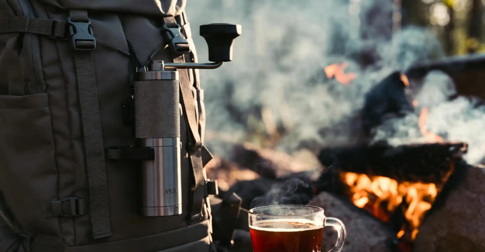
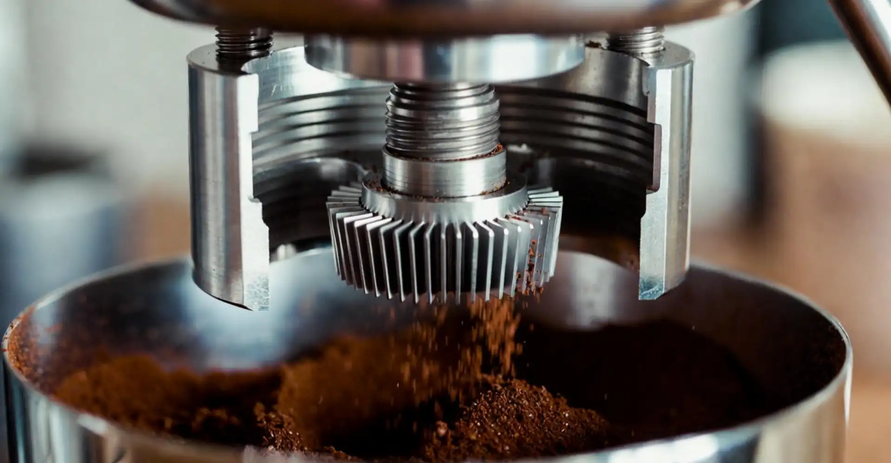

For the coffee enthusiast, travel often presents a dilemma: how do you maintain your high standards for a fresh, quality brew when you’re miles away from your home setup? The answer lies in the [**manual coffee grinder**](https://zaidly.com/).

These compact, hand-powered devices are the ultimate travel companion, offering the precision of a burr grinder without the need for electricity or the bulk of an electric model. They are the single most important piece of gear you can pack to elevate your coffee experience on the road, ensuring you never have to suffer through stale, pre-ground beans again.

In this comprehensive guide, we cut through the noise to bring you the five best manual coffee grinders for travel in 2025. We’ve rigorously tested these models for grind consistency, durability, ease of use, and, most importantly, how well they fit into a suitcase or backpack.

Whether you’re a minimalist backpacker counting every gram or a luxury traveler who refuses to compromise on flavor, we have the perfect portable grinder to make your next trip a truly exceptional coffee journey.

## Quick Comparison Table: Top Travel Grinders


- Grinder Model
- Best For
- Weight (Approx.)
- Burr Material
- Capacity (Approx.)
- Key Feature
---
- **1Zpresso Q Air**
- Ultra-Light Backpacking
- 360g
- Stainless Steel
- 18g
- Fits inside an AeroPress
---
- **Timemore C3 Pro**
- Best Value & All-Rounder
- 473g
- Stainless Steel
- 25g
- Foldable Handle
---
- **VSSL Java**
- Rugged Outdoor Use
- 600g
- Stainless Steel
- 20g
- Integrated Carabiner/Clip
---
- **Porlex Mini II**
- Minimalist & Durable
- 250g
- Ceramic
- 20g
- Extremely Compact
---
- **1Zpresso K-Ultra**
- Uncompromising Performance
- 700g
- Stainless Steel
- 35g
- External Adjustment Dial


## The Reviews: Our Top 5 Manual Travel Grinders

### 1. 1Zpresso Q Air: The Featherweight Champion

The 1Zpresso Q Air is a game-changer for the minimalist traveler. Weighing in at a mere 360 grams, it’s one of the lightest high-performance grinders on the market. While its exterior uses a durable plastic shell to keep the weight down, the core components—the steel frame, bearing system, and the 38mm heptagonal burrs—are the same high-quality standard you’d expect from 1Zpresso. This means you get a remarkably consistent grind quality that punches far above its weight class and price point.

The Q Air’s most celebrated feature is its size: it’s specifically designed to fit snugly inside the plunger of an AeroPress, making it the ultimate space-saver for those who travel with this popular brewer. While the capacity is smaller (around 18 grams), it’s perfect for a single, generous cup of coffee. It’s a testament to the fact that you don't have to sacrifice flavor for portability.

**Pros:**

- **Ultra-Portable:** Extremely light and compact, fits inside an AeroPress.
- **Excellent Grind Quality:** Consistent output thanks to quality steel burrs.
- **Smooth Grinding:** High-quality bearings make for an easy grind.

**Cons:**

- **Plastic Parts:** Less premium feel than all-metal models.
- **Small Capacity:** Best suited for single-cup brewing.

**Who It’s For:** The backpacker, the camper, or the traveler who prioritizes low weight and maximum packability.

  

    

      amazon
      

    

    

    <a href="https://amzn.to/3MQwLB3" target="_blank" rel="nofollow sponsored" class="zaidly-btn-kit amz">CHECK PRICE</a>
  

  

    
AliExpress

    

    <a href="https://s.click.aliexpress.com/e/_c3FKVQg9" target="_blank" rel="nofollow sponsored" class="zaidly-btn-kit ali">CHECK PRICE</a>
  

### 2. Timemore Chestnut C3 Pro: Best Value All-Rounder

The Timemore C3 Pro has quickly become the gold standard for a high-value manual grinder, and its "Pro" designation makes it an excellent travel companion. The key upgrade for travelers is the **foldable handle**, which snaps neatly against the body, significantly reducing the space it takes up in your luggage and protecting the handle from damage.

The C3 Pro features Timemore’s upgraded S2C (Spike to Cut) burrs, which are incredibly efficient and produce a clean, consistent grind, especially for pour-over methods. It offers a comfortable grip and a generous 25-gram capacity, enough for two standard cups. While the grind adjustment is internal, it’s simple to use and reliable. For the traveler who wants a premium feel and excellent performance without breaking the bank, the C3 Pro is the perfect balance.

**Pros:**

- **Foldable Handle:** Excellent for packing and protection.
- **Great Value:** High-end burrs and build quality at a mid-range price.
- **Comfortable Grip:** Textured aluminum body is easy to hold.

**Cons:**

- **Internal Adjustment:** Less convenient than external dials.
- **Slightly Heavier:** Not as light as the Q Air.

**Who It’s For:** The frequent flyer or road-tripper who needs a reliable, high-quality grinder that packs down safely.

  

    

      amazon
      

    

    

    <a href="https://amzn.to/3YhltrP" target="_blank" rel="nofollow sponsored" class="zaidly-btn-kit amz">CHECK PRICE</a>
  

  

    
AliExpress

    

    <a href="https://s.click.aliexpress.com/e/_c3a2E5K9" target="_blank" rel="nofollow sponsored" class="zaidly-btn-kit ali">CHECK PRICE</a>
  

### 3. VSSL Java: Built for the Wild

When your travels take you off the beaten path, you need a grinder that can handle the elements. The VSSL Java is engineered for rugged outdoor use, built from aircraft-grade aluminum and designed to be virtually indestructible. It looks less like a coffee grinder and more like a piece of tactical gear, featuring an integrated carabiner/clip handle that makes it easy to attach to a backpack or harness.

The VSSL Java is fast, thanks to its high-quality stainless steel burr set, and its unique push-button grind selection is intuitive even with cold hands. While it is the heaviest on our list, its durability is unmatched, making it the ideal choice for serious campers, hikers, and overlanders. It’s an investment in a lifetime of fresh coffee, no matter how remote your destination.

**Pros:**

- **Extreme Durability:** Aircraft-grade aluminum construction.
- **Outdoor Ready:** Integrated carabiner and rugged design.
- **Fast Grinding:** Efficient burr set for quick morning brews.

**Cons:**

- **Heavy:** The heaviest option on this list.
- **Expensive:** Premium price point for the rugged build.

**Who It’s For:** The adventurer, the camper, or anyone who needs a grinder that can withstand serious abuse.

  

    

      amazon
      

    

    

    <a href="https://amzn.to/407yHjO" target="_blank" rel="nofollow sponsored" class="zaidly-btn-kit amz">CHECK PRICE</a>
  

### 4. Porlex Mini II: The Classic Minimalist

The Porlex Mini II is a classic for a reason. This Japanese-designed grinder is the definition of compact and simple. Its slim, stainless steel body is incredibly durable and, like the 1Zpresso Q Air, it is perfectly sized to fit inside the plunger of an AeroPress. At only 250 grams, it is the lightest option on our list, making it a favorite among minimalists.

The Mini II uses ceramic burrs, which are less prone to dulling than steel and are completely rust-proof, a major plus for humid or wet environments. While ceramic burrs are generally slower and slightly less consistent than modern steel burrs, the Porlex Mini II still delivers a perfectly acceptable grind for most travel brewing methods. Its simplicity and near-indestructibility make it a reliable, no-fuss travel partner.

**Pros:**

- **Lightest Option:** Ideal for weight-conscious travelers.
- **AeroPress Compatible:** Fits inside the plunger.
- **Ceramic Burrs:** Rust-proof and durable.

**Cons:**

- **Slower Grinding:** Ceramic burrs take more effort and time.
- **Less Consistent:** Grind quality is good, but not on par with 1Zpresso or Timemore steel burrs.

**Who It’s For:** The minimalist traveler, the budget-conscious, or those who prioritize a rust-proof, simple design.

  

    

      amazon
      

    

    

    <a href="https://amzn.to/3WzAtwI" target="_blank" rel="nofollow sponsored" class="zaidly-btn-kit amz">CHECK PRICE</a>
  

### 5. 1Zpresso K-Ultra: Uncompromising Performance

For the coffee connoisseur who refuses to accept any drop in quality while traveling, the 1Zpresso K-Ultra is the answer. While it is the largest and heaviest of our top picks, it offers a world-class grinding experience that rivals many electric grinders. It features a large 48mm burr set and an industry-leading **external adjustment dial**, allowing you to switch grind settings with speed and precision—a huge advantage if you use different brewing methods on your trip.

The K-Ultra comes with a high-quality travel case, a foldable handle, and a magnetic catch cup, all designed to make the travel experience as smooth as possible. It is a premium piece of equipment for the traveler who views their coffee ritual as a non-negotiable luxury. If you have the space and the budget, this grinder ensures your travel coffee is just as good as your home brew.

**Pros:**

- **Unmatched Consistency:** World-class grind quality across all settings.
- **External Adjustment:** Quick and precise grind changes.
- **Premium Features:** Foldable handle, magnetic catch cup, travel case included.

**Cons:**

- **Heaviest/Bulkiest:** Requires more luggage space.
- **Highest Price:** A significant investment.

**Who It’s For:** The enthusiast who travels with multiple brewing devices and demands the absolute best grind quality.

  

    

      amazon
      

    

    

    <a href="https://amzn.to/42O7I2l" target="_blank" rel="nofollow sponsored" class="zaidly-btn-kit amz">CHECK PRICE</a>
  

  

    
AliExpress

    

    <a href="https://s.click.aliexpress.com/e/_DdYV0m7" target="_blank" rel="nofollow sponsored" class="zaidly-btn-kit ali">CHECK PRICE</a>
  

## The Essential Travel Grinder Buying Guide

Choosing the right travel grinder is about balancing performance with portability. The "best" grinder for you depends entirely on your travel style and your coffee priorities. Here are the four critical factors to consider before you buy.

### 1. Portability: Weight and Size

The first consideration for any travel gear is how easily it fits into your luggage. For **backpackers and hikers**, weight is paramount. Look for grinders under 400g, such as the 1Zpresso Q Air or the Porlex Mini II. For **car campers or hotel travelers**, you have more flexibility and can opt for the heavier, higher-performance models like the 1Zpresso K-Ultra. Pay attention to the diameter and length; models that fit inside an AeroPress are the ultimate space-savers.

### 2. Grind Consistency and Burr Material

The quality of your coffee is directly tied to the consistency of your grind. A good travel grinder must have **burrs**, not blades, to crush the coffee uniformly.

- **Stainless Steel Burrs:** Found in all 1Zpresso and Timemore models, these are the current gold standard. They are faster, more efficient, and produce a more consistent particle size, which is crucial for a clean-tasting cup.
- **Ceramic Burrs:** Found in the Porlex Mini II, these are durable, rust-proof, and hold an edge well. However, they are slower to grind and generally produce a less consistent particle distribution, which can lead to a muddier cup.

If you primarily brew pour-over or espresso, opt for steel burrs. If you only brew French Press or need maximum durability in wet conditions, ceramic may suffice.

### 3. Adjustment Mechanism

How you change your grind setting matters, especially when traveling.

- **External Adjustment:** The most convenient system (e.g., 1Zpresso K-Ultra). The dial is on the outside of the grinder, allowing you to quickly and easily switch between settings without disassembling the grinder. This is ideal for travelers who use multiple brewing methods (e.g., espresso one day, pour-over the next).
- **Internal Adjustment:** The most common system (e.g., Timemore C3 Pro, 1Zpresso Q Air). The adjustment dial is located underneath the burrs, requiring you to remove the catch cup to change the setting. While less convenient, it is often more compact and less prone to accidental changes.

### 4. Durability and Build Quality

Travel gear takes a beating. Look for grinders with a full metal body (aluminum or stainless steel) that can withstand being tossed into a bag. Features like a **foldable handle** (Timemore C3 Pro, 1Zpresso K-Ultra) are not just about saving space; they protect the handle from being bent or broken in transit. The VSSL Java is the clear winner here for sheer ruggedness, but all the top models we recommend offer excellent build quality that will last for years of adventures.

## Frequently Asked Questions (FAQs)

### Q: Are manual grinders as good as electric grinders?

**A:** Yes, the best manual grinders, particularly those with high-quality steel burrs like the 1Zpresso K-Ultra, can produce a grind quality that is equal to or better than many electric burr grinders costing several hundred dollars. For travel, they are superior due to their portability and lack of reliance on electricity.

### Q: How long does it take to grind coffee manually?

**A:** Grinding 15-20 grams of coffee (enough for one to two cups) typically takes between 30 seconds and 1 minute, depending on the grinder model and the desired grind size. Finer grinds (like espresso) take longer and require more effort than coarser grinds (like French Press).

### Q: Can I use a travel grinder for espresso?

**A:** Some travel grinders are capable of espresso, but not all. Espresso requires extremely fine and precise adjustments. Models like the 1Zpresso K-Ultra are designed with the necessary micro-adjustments to dial in espresso shots. Budget models like the Porlex Mini II are generally not recommended for espresso.

### Q: How do I clean my manual coffee grinder while traveling?

**A:** For a quick clean, simply disassemble the grinder and use a small brush (many come with one) to sweep away any retained grounds. Avoid using water unless the manufacturer explicitly states the burrs are rust-proof and you have time for them to dry completely. A deep clean is best saved for when you return home.

## Final Verdict: The Best Manual Grinder for Your Next Trip

Choosing the best manual coffee grinder for travel is a personal decision based on your priorities.

If you are looking for the **absolute best performance** and don't mind a little extra weight, the **1Zpresso K-Ultra** is the undisputed champion. Its external adjustment and superior burrs make it a joy to use.

However, for the vast majority of travelers, we recommend the **Timemore Chestnut C3 Pro**. It offers an exceptional blend of high-quality grind, a durable metal body, and the crucial foldable handle, all at a price point that is hard to beat. It is the perfect all-rounder that will satisfy both the casual traveler and the dedicated coffee lover.

Finally, for the **ultra-light backpacker**, the **1Zpresso Q Air** is the clear winner. Its ability to fit inside an AeroPress and its minimal weight make it the most packable high-performance grinder available.

No matter which model you choose, investing in a quality manual grinder is the single best way to ensure your coffee ritual remains intact, no matter where your travels take you.

---

## Deep Dive: Why Grind Consistency Matters for Travel

To truly understand why a high-quality burr grinder is essential for travel, we must discuss **grind consistency**. When you grind coffee, you are aiming for a uniform particle size. If your grounds are inconsistent—a mix of fine dust (fines) and large chunks (boulders)—you will get an uneven extraction. The fines will over-extract, leading to bitterness, while the boulders will under-extract, leading to sourness. The result is a cup that is simultaneously bitter and sour, or simply muddy and flat.

---

## Internal Resources

- [How to Choose the Right Coffee Grind Size](https://zaidly.com/blog)
- [The Best Portable Coffee Makers for Camping](https://zaidly.com/)

---

## References

[1] Coffee Chronicler. *The 9 Best Manual Coffee Grinders in 2025 | No BS Review*. https://coffeechronicler.com/  
[2] Serious Eats. *The 3 Best Handheld Coffee Grinders of 2025, Tested & Reviewed*. https://www.seriouseats.com/  
[3] Wirecutter. *The 4 Best Coffee Grinders of 2025*. https://www.nytimes.com/
